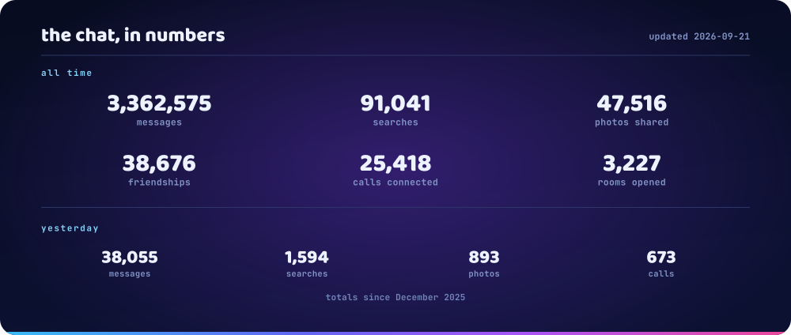
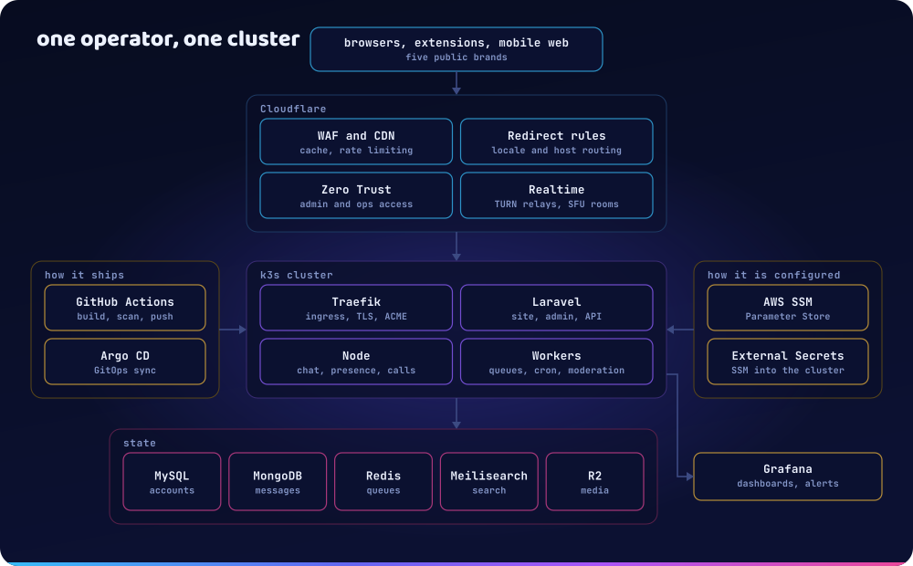
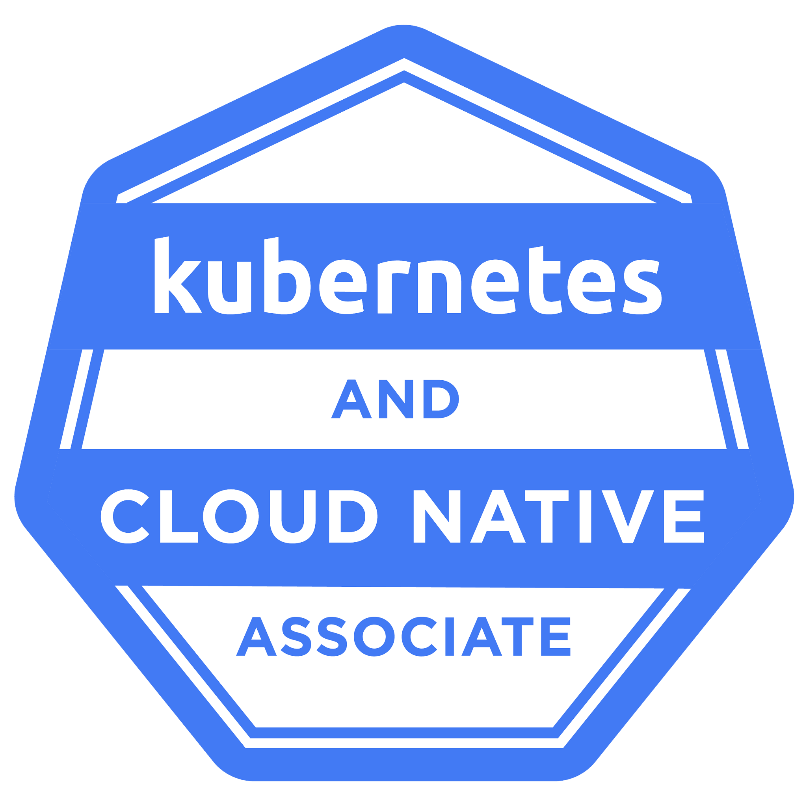
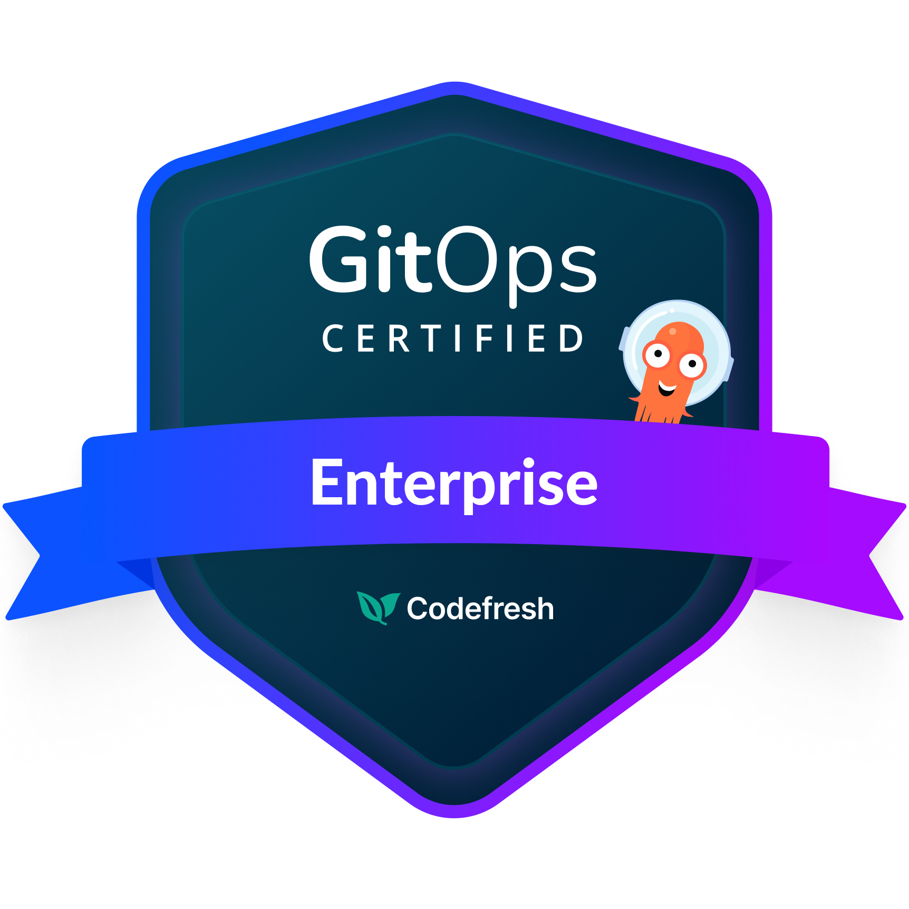
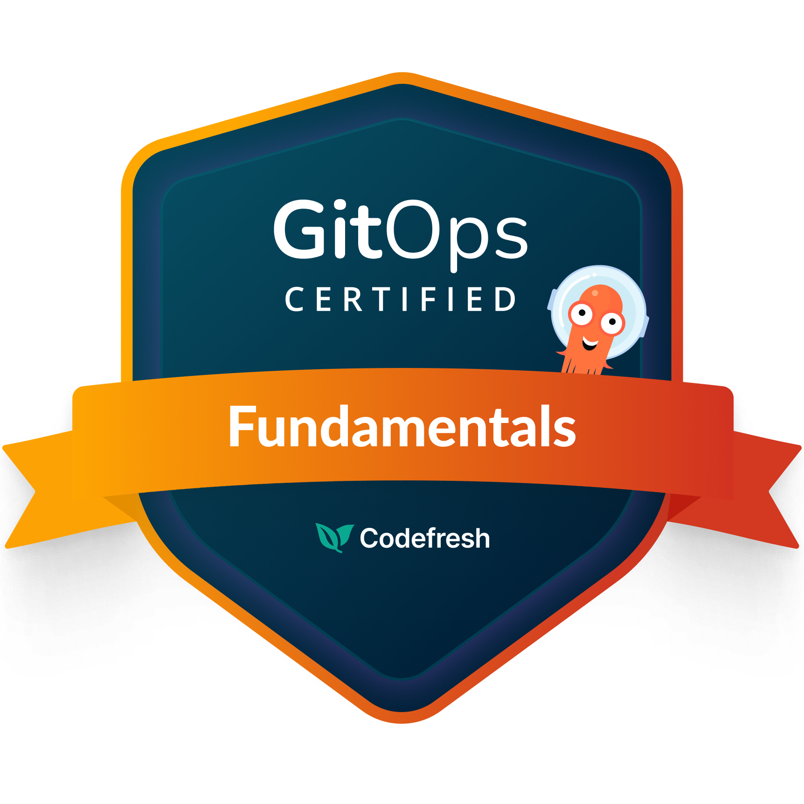
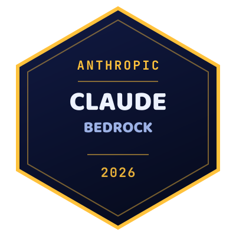
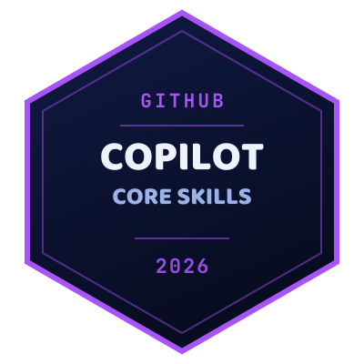

<div align="center">
  
</div>

<div align="center">

[](https://cursor.style) [](https://linkedin.com/in/oleksisem/) [](https://t.me/wonchoe) [](https://github.com/wonchoe)  [](https://github.com/wonchoe/wonchoe/actions/workflows/main.yml)

</div>

## What I do

I build browser products for people who are mostly not developers - a kid picking a rainbow cursor, a teenager reskinning their YouTube player - and I run everything underneath them myself: Cloudflare at the edge, k3s and Argo CD in the middle, MySQL, MongoDB and object storage at the back.

So the interesting problems are rarely the pretty ones. Judging every photo and message in the room before anyone else sees it. Keeping one container image from eating a node. Serving nine figures of requests a month on a budget that would make a funded startup laugh.

## What I run

| Product | What it is | Reach |
| :-- | :-- | :-- |
| **[cursor.style](https://cursor.style)** | The largest free cursor library, plus the extension that applies them | [](https://chromewebstore.google.com/detail/bmjmipppabdlpjccanalncobmbacckjn) [](https://chromewebstore.google.com/detail/bmjmipppabdlpjccanalncobmbacckjn) |
| **[cursor-land.com](https://cursor-land.com)** | Second cursor brand - same engine, its own audience | [](https://chromewebstore.google.com/detail/oinkhgpjmeccknjbbccabjfonamfmcbn) [](https://chromewebstore.google.com/detail/oinkhgpjmeccknjbbccabjfonamfmcbn) |
| **[youtube-skins.com](https://youtube-skins.com)** | 130+ skins for the YouTube player, and an ad skipper beside it | [](https://chromewebstore.google.com/detail/imomahaddnhnhfggpmpbphdiobpmahof) [](https://chromewebstore.google.com/detail/imomahaddnhnhfggpmpbphdiobpmahof) |
| **[fb.zone](https://fb.zone)** | Video and photo background themes for Facebook | [](https://chromewebstore.google.com/detail/oodajhdbojacdmkhkiafdhicifcdjoig) [](https://chromewebstore.google.com/detail/oodajhdbojacdmkhkiafdhicifcdjoig) |
| **[Chat](https://cursor.style)** | Moderated rooms, direct messages, photo albums and WebRTC calls, built into the main site | rooms, DMs, group voice |
| **[Slither](https://cursor.style/games/slither)** | Free multiplayer snake, no install, no account | live on the games hub |
| **[Terra](https://terra.cursor.style)** | Open 3D world you can run around in, built on streamed low-poly terrain | in preview |
| **[agropost.com.ua](https://agropost.com.ua)** | Ukrainian agricultural marketplace: listings, company catalogue, grain logistics | running since 2010 |
| **[agro-post.com](https://agro-post.com)** | The same platform for the US market | live |

<sub>Counts and ratings are pulled live from the Chrome Web Store every time this page loads.</sub>

## The one that got big

<div align="center">
  
</div>

<div align="center">
  
</div>

<!-- CF-STATS:START -->

**148,421,034** requests &nbsp;·&nbsp; **16,953,289** page views &nbsp;·&nbsp; **5,219,280** unique visitors &nbsp; over the last 30 days

<sub>Yesterday alone: 5,313,755 requests from 200,855 people. Refreshed 2026-09-11 by the workflow above.</sub>

<!-- CF-STATS:END -->

## The one with the moderation problem

The chat grew out of the cursor library and runs in the same pod as the site: rooms, direct messages, photo albums, group voice and WebRTC calls, in 49 languages. Most of the people in it are teenagers, and that one fact decides almost everything about how it has to be built.

So the hard part was never the sockets. It is that every username, every message and every photo has to be judged before anyone else sees it, in languages I do not read, in under a second, at a cost per item of approximately nothing.

| Layer | What runs |
| :-- | :-- |
| **Photos** | OpenAI `omni-moderation-latest`, with per-category score thresholds measured against real uploads rather than guessed |
| **A second opinion on photos** | Amazon Rekognition, wired in beside it and running in shadow: it logs its labels and decides nothing until they prove the thresholds. The two miss different things - a real shotgun scored 0 at OpenAI and 100 at Rekognition, which is the whole argument for keeping both |
| **Text** | The same moderation model, then `gpt-4o-mini` on what scores zero and is still a problem: a phone number handed over in a direct message, or an intent that only reads as harmful in the language it was written in |
| **Words** | A two-level dictionary per language, because in some of them a slur is one space away from an ordinary phrase, and a naive filter bans half the room |
| **Reports** | Triaged automatically before a human opens them, with a ladder of sanctions that does not wait for one |
| **Warnings** | Treated as a product rather than a log line: a badge beside the avatar, a modal the account has to acknowledge, and a record of what was decided and when |

Failing open is the expensive direction here, so an outage at the moderator fails the upload instead of waving it through.

<div align="center">
  
</div>

## The one universities cite

AgroPost has run since 2010: a marketplace, company catalogue and grain-logistics board for Ukrainian agriculture, now with a US edition at [agro-post.com](https://agro-post.com). It is the least glamorous thing I operate and the one that ended up in other people's teaching materials.

| Institution | Where it appears | Year |
| :-- | :-- | :-- |
| Odesa State Agrarian University | [Course work programme](https://osau.edu.ua/wp-content/uploads/2026/03/OP-02_RP_TVPR-H7-2025-26.pdf), listing AgroPost as a notice board, company catalogue and trading platform | 2025 |
| Mykolaiv National Agrarian University | [Methodical recommendations](https://www.mnau.edu.ua/files/faculty/agronomij/opp/tehnologiya-virobnictva-produkciyi-roslinnictva-metodichni-rekomendaciyi.pdf) for crop production technology | 2021 |
| Mykolaiv National Agrarian University | [Technical crops](https://dspace.mnau.edu.ua/jspui/bitstream/123456789/2387/1/Tekhnichni_kultury.pdf) teaching material | 2016 |
| National University of Food Technologies | [Conference proceedings](https://conference.nuft.edu.ua/leanfoodpack/Books/Abstracts/A_2015.pdf), bibliography citing the elevators directory | 2015 |

## How it holds together

<div align="center">
  
</div>

Five public brands, one cluster, one operator. Nothing reaches production except through Git: Actions builds and pushes the image, Argo CD syncs the manifests, External Secrets pulls configuration out of AWS Parameter Store, and Cloudflare Zero Trust is the only door into the admin side. If it is not in a repository, it is not running.

## Certifications

<div align="center">
<table>
  <tr>
    <td align="center" width="25%"><br><sub><b>AWS DevOps Engineer</b><br>Professional</sub></td>
    <td align="center" width="25%"><br><sub><b>AWS Solutions Architect</b><br>Associate</sub></td>
    <td align="center" width="25%"><br><sub><b>AWS Cloud Practitioner</b><br>Foundational</sub></td>
    <td align="center" width="25%"><br><sub><b>Kubernetes &amp; Cloud Native</b><br>Associate (KCNA)</sub></td>
  </tr>
  <tr>
    <td align="center"><br><sub><b>GitOps Certified</b><br>Enterprise · Codefresh</sub></td>
    <td align="center"><br><sub><b>GitOps Certified</b><br>Fundamentals · Codefresh</sub></td>
    <td align="center"><br><sub><b>GitHub Actions</b><br>Certification Program</sub></td>
    <td align="center"><br><sub><b>Microsoft MTA</b><br>Networking Fundamentals</sub></td>
  </tr>
  <tr>
    <td align="center"><br><sub><b>Claude with Amazon Bedrock</b><br>Anthropic · September 2026</sub></td>
    <td align="center"><br><sub><b>GitHub Copilot</b><br>Core Skills · March 2026</sub></td>
    <td align="center"><br><sub><b>Azure DevOps to GitHub</b><br>Enterprise migrations · December 2025</sub></td>
    <td></td>
  </tr>
</table>
</div>

<sub>Eleven in total. The last three are set in this page's own style, because the issuers publish no badge artwork for them.</sub>

## Toolbox

**Edge and delivery**
      

**Services and data**
      

**In the browser**
     

## On GitHub

<div align="center">
  
</div>

<div align="center">
  <picture>
    <source media="(prefers-color-scheme: dark)" srcset="https://raw.githubusercontent.com/wonchoe/wonchoe/output/snake-dark.svg">
    
  </picture>
</div>

## Worth a look

| Repository | What it does |
| :-- | :-- |
| **[laravel-gsc-manager](https://github.com/wonchoe/laravel-gsc-manager)** | Google Search Console inside Laravel, authenticated with a service account |
| **[ai-php-json-files-language-translator](https://github.com/wonchoe/ai-php-json-files-language-translator)** | Translates PHP, JSON and plain-text language files with an LLM, keeping placeholders intact |
| **[tabler-icons-font-picker](https://github.com/wonchoe/tabler-icons-font-picker)** | Tabler icon picker with categories, search and a drop-in field |
| **[image-processing](https://github.com/wonchoe/image-processing)** | Image pipeline on AWS: ECS, Lambda, Aurora and S3 |
| **[slither](https://github.com/wonchoe/slither)** | The multiplayer snake running at [cursor.style/games](https://cursor.style/games) |

<details>
<summary><b>How this page builds itself</b></summary>

<br>

Nothing here is a screenshot, and no image is hand-placed pixel art.

- **`assets/hero.svg`** is generated by `tools/build_hero.py`. GitHub serves README images under `default-src 'none'`, so an SVG can never pull a web font down. Every piece of display type is therefore baked into `<path>` outlines from ASCII subsets of Baloo 2 and JetBrains Mono, kept in `tools/fonts/` with their OFL licences. The mascot is embedded as a data URI for the same reason.
- **`assets/traffic.svg`** is redrawn every night. `update_readme.mjs` asks the Cloudflare GraphQL API for yesterday and for the last 30 days, writes `assets/traffic.json`, and `tools/build_traffic.py` turns that into the chart above - bars, busiest-day marker, aligned figures and all.
- **`assets/github.svg`** is the same idea pointed at the GitHub GraphQL API. The usual readme-stats services were answering 503 and 402 while this page was built, so the card is generated here instead and cannot go down on its own.
- **The numbers in the text** come from the same run, so the readable version stays correct even if images are blocked.
- **The snake** is redrawn from the contribution graph by a second workflow and published to the `output` branch.

Rebuild the artwork locally with:

```bash
pip install fonttools pillow
python tools/build_hero.py
python tools/build_traffic.py
GITHUB_TOKEN=... python tools/build_github_card.py
```

</details>

## Say hello

[](https://linkedin.com/in/oleksisem/) [](https://t.me/wonchoe) [](https://cursor.style)

